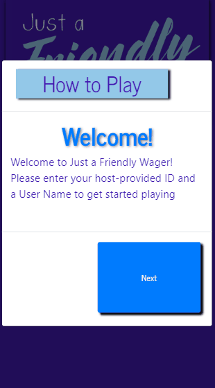
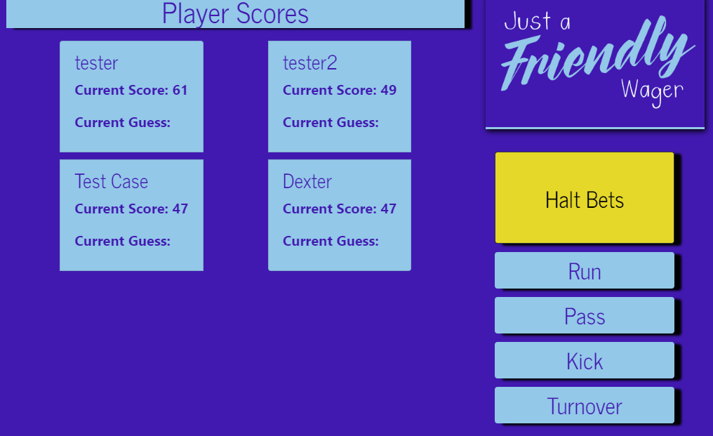

# Just a Friendly Wager

## Getting Started

Just a Friendly Wager is a betting app, which allows users to login and bet on future events.

#### The User Page:


#### Interaction Between the User Page and the Admin Page:


For a demo of the app, visit: <https://justafriendlywager.herokuapp.com>

### Prerequisites

To download and test this app, you will need the Node Packet Manager installed.  For more information, visit: <https://www.npmjs.com/get-npm>

You will also need Node.js installed.  For more information, visit <https://nodejs.org/en/download/>

Finally, you will need MongoDB installed. For more information, visit <https://www.mongodb.com/download-center>

### Installing

To install, access the Github page <https://github.com/itsgoodtobegrant/project3>.  You may fork the repository and then clone it to your computer.  

Next, you will need to download the required NPM packages.  The required NPM packages include:
```
    "axios": "^0.18.1",
    "bootstrap": "^4.4.1",
    "dotenv": "^8.2.0",
    "express": "^4.17.1",
    "if-env": "^1.0.4",
    "mongoose": "^5.3.16",
    "nodemailer": "^6.4.2",
    "react-bootstrap": "^1.0.0-beta.16",
    "react-router-dom": "^5.1.2",
    "socket.io": "^2.3.0"
```
Because these packages are listed as dependencies already in the package.json file, you may install these packages by typing `npm install` on the commandline.

You will also need MongoDB installed for your database <https://www.mongodb.com/download-center>

Your app should now be ready for testing and then deployment.

Then, To use this app on your local device, run the backend with the following command on the command line:
```
node server.js
```
OR, run the frontend with the following command on the command line:
```
npm start
```


Then go to the following URL in your browser: `localhost:3000`
You should be able to enter your unique username, store it to the database, and got to the game page.

## Deployment and General Use
This app can be deployed to a server, such as Heroku or AWS, for online use from different users in different locations. To store data input, you will need to utilize an online database, such as the `JawsDB` add-on offered by Heroku.

## Built With

* Javascript
* React
* Socket.io
* Bootstrap Framework
* MongoDB

## Authors

> Grant Bowen [@itsgoodtobegrant](https://github.com/itsgoodtobegrant) , Taylor Ellis [@teelis20](https://github.com/teellis20), Sarah Arnold [@digipet007](https://github.com/digipet007)
